# 📘 Manual Tècnic - BiciFood

## 📋 Índex
1. [Descripció del Producte](#1-descripció-del-producte)
2. [Tecnologies i Llenguatges](#2-tecnologies-i-llenguatges)
3. [Disseny de la Interfície d'Usuari](#3-disseny-de-la-interfície-dusuari)
4. [Disseny de la Base de Dades](#4-disseny-de-la-base-de-dades)
5. [Documentació del Codi Font](#5-documentació-del-codi-font)
6. [Instal·lació i Configuració](#6-instal·lació-i-configuració)

---

## 1. Descripció del Producte

### 1.1. Visió General
**BiciFood** és una aplicació web per a comandes de menjar a domicili amb repartiment sostenible en bicicleta. L'aplicació permet als usuaris navegar pel catàleg de productes, realitzar comandes i fer el seguiment del seu lliurament.

### 1.2. Funcionalitats Principals

#### 👤 Gestió d'Usuaris
- **Registre i autenticació** d'usuaris amb sistema de rols (CLIENT, REPARTIDOR, ADMIN)
- **Gestió de perfils** amb dades personals i adreces de lliurament
- **Sistema de punts** acumulatius per a clients habituals
- **Autenticació JWT** per a la seguretat de les sessions

#### 🍽️ Catàleg de Productes
- **Navegació per categories**: CARNS, PEIXOS, AMANIDES I VEGETALS, ARRÒS I PASTA, BEGUDES, POSTRES
- **Cerca de productes** per nom
- **Detall de productes** amb imatges, descripció, preu i disponibilitat
- **Control d'estoc** en temps real

#### 🛒 Gestió de Comandes
- **Cistella de compra** amb emmagatzematge local
- **Procés de checkout** amb validació d'adreces
- **Seguiment d'estat** de comandes (PENDENT, PREPARANT, EN RUTA, LLIURADA)
- **Càlcul automàtic** de preus i subtotals

#### 🚴 Sistema de Lliuraments
- **Assignació de repartidors** a comandes
- **Registre de temps** d'assignació i lliurament real
- **Vinculació** entre comandes i repartidors

#### 🌍 Internacionalització
- **Suport multiidioma** (Català, Castellà, Anglès)
- **Canvi dinàmic** d'idioma sense recarregar la pàgina

---

## 2. Tecnologies i Llenguatges

### 2.1. Backend

#### Framework Principal
- **Spring Boot 3.3.5**
  - Framework de desenvolupament Java per a aplicacions empresarials
  - Proporciona configuració automàtica i servidor embegut

#### Llenguatge de Programació
- **Java 21 (LTS)**
  - Versió de suport a llarg termini
  - Aprofita les últimes característiques del llenguatge (Records, Pattern Matching, etc.)

#### Mòduls Spring
- **Spring Boot Starter Web**: Per crear APIs RESTful
- **Spring Boot Starter Data JPA**: Per a la persistència i accés a dades
- **Spring Boot Starter Security**: Per a l'autenticació i autorització
- **Spring Boot Starter Validation**: Per a la validació de dades
- **Spring Boot Starter Actuator**: Per al monitoratge i gestió de l'aplicació

#### Base de Dades
- **H2 Database** (en memòria)
  - Base de dades SQL embeguda
  - Ideal per a desenvolupament i proves
  - Configurable per a persistència en fitxer
- **MySQL** (suportat, actualment comentat al pom.xml)
  - Base de dades relacional per a producció

#### Seguretat
- **JJWT 0.12.3** (JSON Web Tokens)
  - Autenticació basada en tokens
  - Sessions sense estat (stateless)

#### Documentació API
- **SpringDoc OpenAPI 2.2.0** (Swagger)
  - Generació automàtica de documentació API
  - Interfície interactiva per a provar endpoints
  - Accés: http://localhost:8080/api/v1/swagger-ui/index.html

#### Mapatge d'Objectes
- **ModelMapper 3.2.0**
  - Conversió automàtica entre entitats JPA i DTOs
  - Reducció de codi repetitiu

#### Eines de Desenvolupament
- **Maven 3.11.0**: Gestió de dependències i construcció del projecte
- **Spring Boot DevTools**: Recàrrega automàtica durant el desenvolupament

### 2.2. Frontend

#### Tecnologies Base
- **HTML5**: Estructura semàntica de les pàgines
- **CSS3**: Estils personalitzats amb preprocessadors
- **JavaScript ES6+**: Lògica del client i comunicació amb l'API

#### Framework CSS
- **Bootstrap 5.3.3**
  - Sistema de graella responsive
  - Components UI preconstruïts
  - Utilitats per a disseny ràpid

#### Comunicació amb Backend
- **Fetch API**: Peticions HTTP asíncrones
- **Classe BiciFoodAPI**: Client API personalitzat per a gestionar totes les comunicacions

#### Emmagatzematge
- **localStorage**: Persistència de la cistella de compra en el navegador

#### Sistema d'Internacionalització
- **i18n.js**: Sistema personalitzat de traducció
- **Fitxers JSON** per a cada idioma (ca.json, es.json, en.json)

### 2.3. Infraestructura

#### Contenidorització
- **Docker**
  - Dockerfile multinivell per a construcció optimitzada
  - Contenidor únic amb backend i frontend
  - Servidor HTTP Python per al frontend

#### Sistema de Construcció
- **Maven Wrapper (mvnw)**
  - Assegura versió consistent de Maven
  - No requereix instal·lació prèvia de Maven

#### Scripts d'Execució
- **Scripts Bash** (Unix/Linux/macOS)
  - `start-bicifood.sh`: Inicia backend i frontend
  - `stop-bicifood.sh`: Atura els serveis
- **Scripts Batch** (Windows)
  - `start-bicifood.bat`: Inicia backend i frontend
  - `stop-bicifood.bat`: Atura els serveis

---

## 3. Disseny de la Interfície d'Usuari

### 3.1. Estructura de Pàgines

L'aplicació frontend està organitzada en diverses pàgines HTML ubicades a `frontend/html/TEA5/`:

#### Pàgines Principals

| Pàgina | Fitxer | Descripció |
|--------|--------|------------|
| **Inici** | `index.html` | Pàgina principal amb productes destacats |
| **Categories** | `categories.html` | Llistat de productes filtrats per categoria |
| **Detall Producte** | `detall_product.html` | Informació detallada d'un producte |
| **Resultats de Cerca** | `resultats_cerca.html` | Productes trobats per cerca |
| **Cistella** | `cistella.html` | Visualització i gestió de la cistella |
| **Checkout** | `checkout.html` | Procés de finalització de comanda |
| **Pagament** | `pagament.html` | Confirmació de pagament |
| **Login** | `login.html` | Autenticació d'usuaris |
| **Registre** | `registrat.html` | Creació de nous comptes |
| **Nosaltres** | `nosaltres.html` | Informació sobre l'empresa |
| **Contacte** | `contacte.html` | Formulari de contacte |
| **Política** | `politica.html` | Política de privacitat i termes |
| **Configuració** | `userConfig.html` | Configuració del perfil d'usuari |

### 3.2. Components Reutilitzables

#### Navbar
- Barra de navegació superior amb logo
- Menú desplegable de categories
- Cercador de productes
- Selector d'idioma (ca, es, en)
- Cistella amb comptador d'articles
- Enllaços de login/registre

#### Footer
- Enllaços a seccions corporatives
- Xarxes socials
- Informació de contacte
- Copyright

#### Targetes de Producte
- Imatge del producte amb fallback
- Nom i descripció
- Preu i disponibilitat d'estoc
- Botó "Afegir a la cistella"

### 3.3. Estils i Disseny

#### Sistema de Colors
Definits a `style.css`:
- **Color primari**: Tonalitats verdes (#28a745) - Sostenibilitat
- **Color secundari**: Marrons (#8B4513) - Natural
- **Accent**: Taronja per a accions destacades
- **Neutres**: Grisos per a textos i fons

#### Responsive Design
- **Mobile First**: Disseny optimitzat per a mòbils
- **Breakpoints**: Adaptació per a tablets i desktops
- **Grid Bootstrap**: Sistema de 12 columnes

#### Efectes i Animacions
- Transicions suaus en hover
- Animacions de fade per a alertes
- Efectes de focus en formularis
- Botó de scroll to top animat

### 3.4. Flux d'Usuari

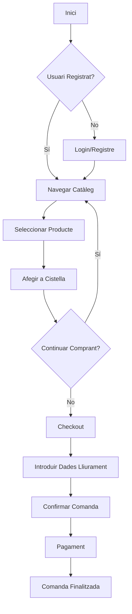
```mermaid
graph TD
    A[Inici] --> B{Usuari Registrat?}
    B -->|No| C[Login/Registre]
    B -->|Sí| D[Navegar Catàleg]
    C --> D
    D --> E[Seleccionar Producte]
    E --> F[Afegir a Cistella]
    F --> G{Continuar Comprant?}
    G -->|Sí| D
    G -->|No| H[Checkout]
    H --> I[Introduir Dades Lliurament]
    I --> J[Confirmar Comanda]
    J --> K[Pagament]
    K --> L[Comanda Finalitzada]
```

### 3.5. Wireframes Inicials

Durant la fase de disseny inicial, es van crear wireframes per planificar l'estructura i funcionalitat de les principals pantalles de l'aplicació:

#### Confirmació de Pagament amb Seguiment

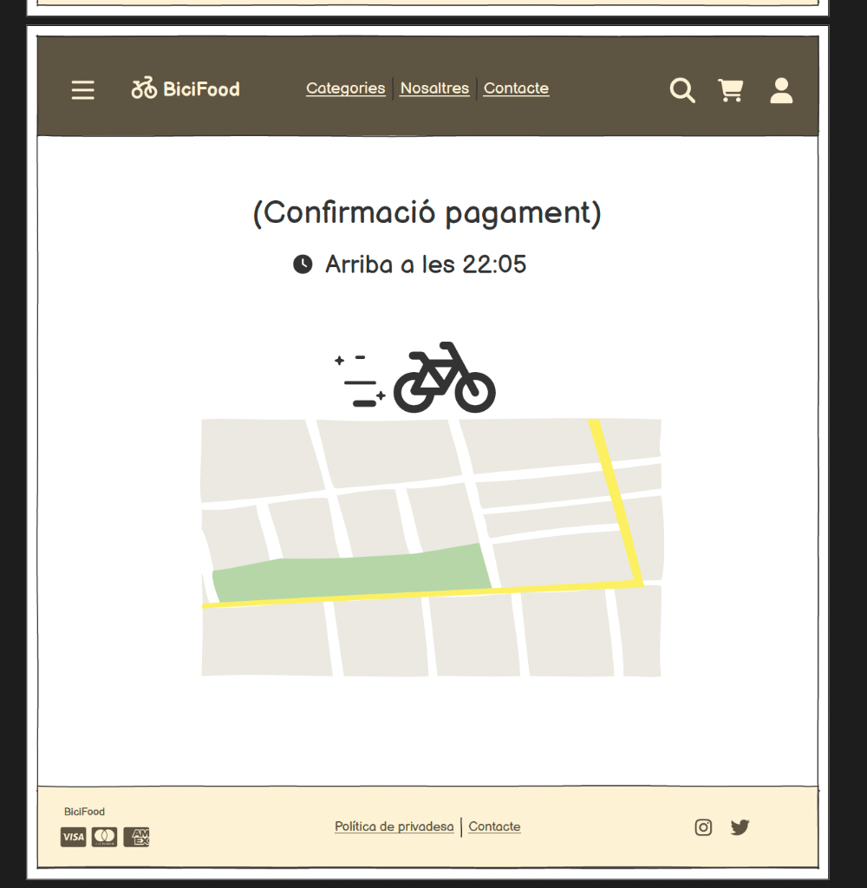

*Figura 3.1: Wireframe de la pàgina de confirmació de pagament amb mapa de seguiment del repartidor en temps real.*

#### Resultats de Cerca

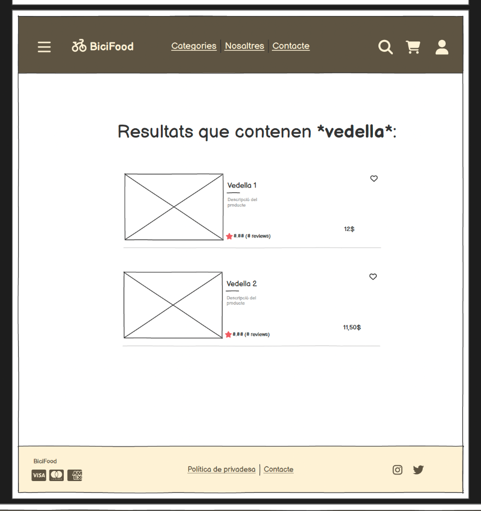

*Figura 3.2: Wireframe dels resultats de cerca de productes amb llistat i filtres.*

#### Pàgina de Contacte

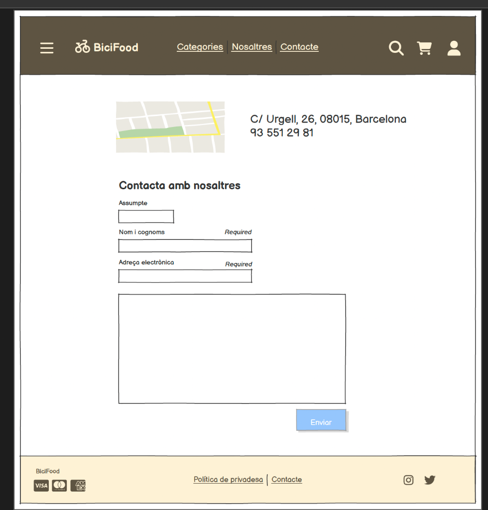

*Figura 3.3: Wireframe del formulari de contacte amb mapa de localització.*

#### Pàgina Nosaltres

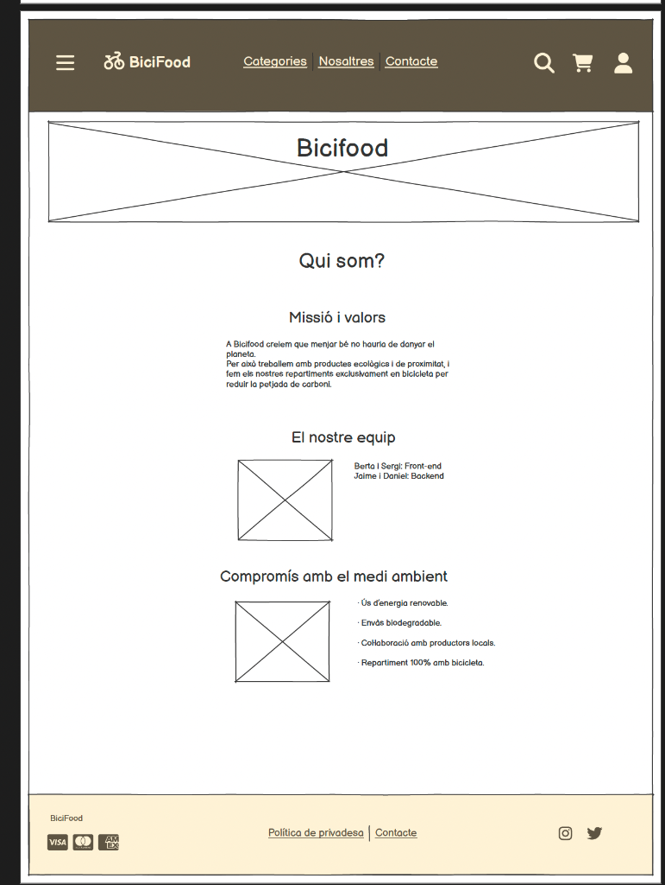

*Figura 3.4: Wireframe de la pàgina corporativa amb missió, valors i equip.*

#### Cistella de Compra

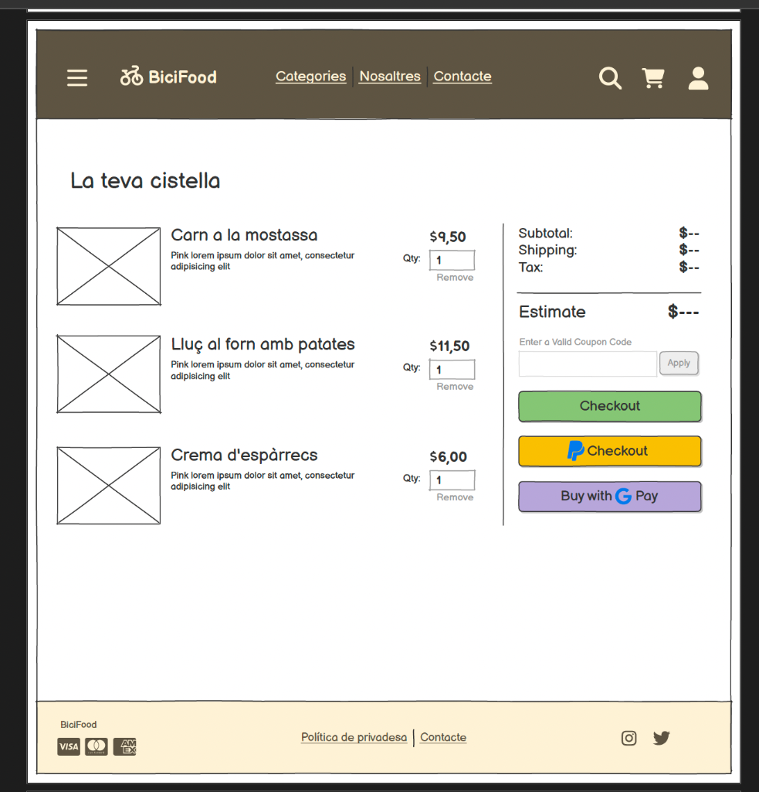

*Figura 3.5: Wireframe de la cistella amb llistat de productes i opcions de pagament.*

### 3.6. Captures de l'Aplicació Real

A continuació es mostren captures de pantalla de l'aplicació BiciFood en funcionament:

#### Pàgina d'Inici

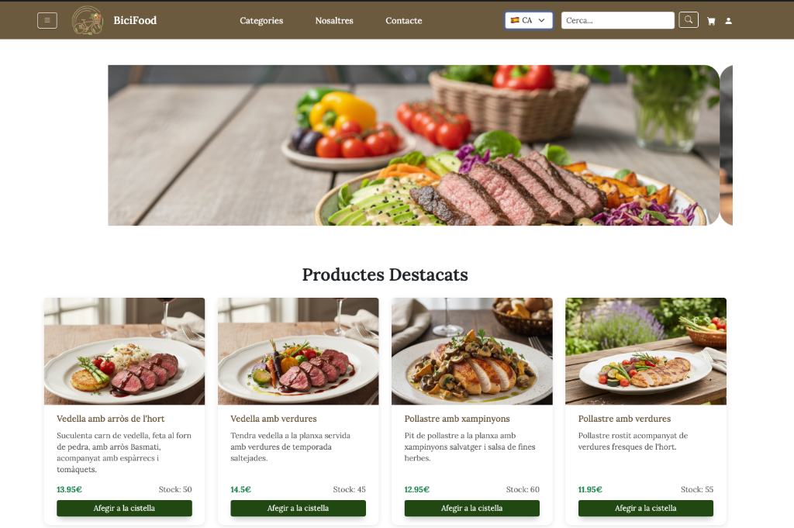

*Figura 3.6: Pàgina principal amb imatge hero i secció de productes destacats.*

#### Cistella de Compra

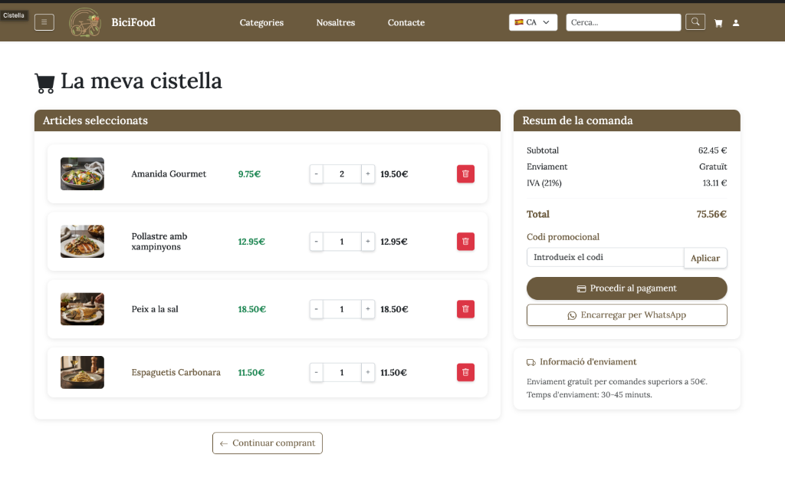

*Figura 3.7: Cistella amb productes seleccionats, control de quantitat i resum de comanda.*

#### Cistella amb Codi Promocional

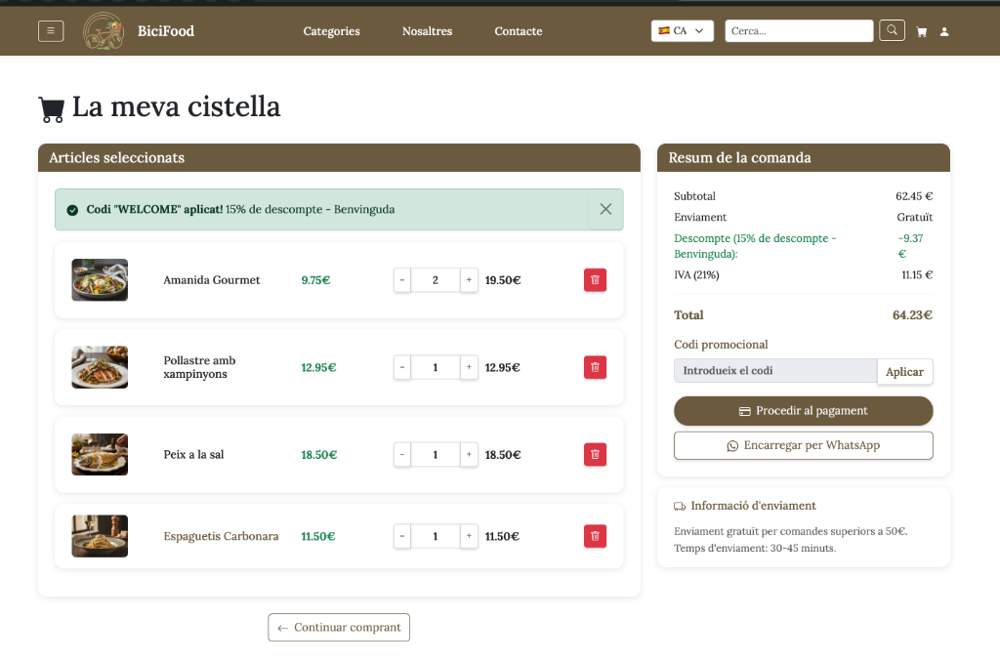

*Figura 3.8: Cistella amb codi promocional aplicat mostrant el descompte del 15%.*

#### Procés de Checkout

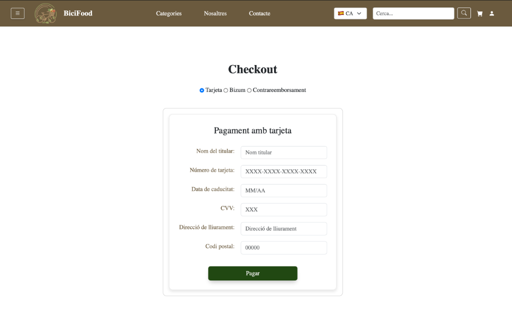

*Figura 3.9: Formulari de pagament amb opcions de targeta, Bizum i contrareemborsament.*

#### Configuració d'Usuari

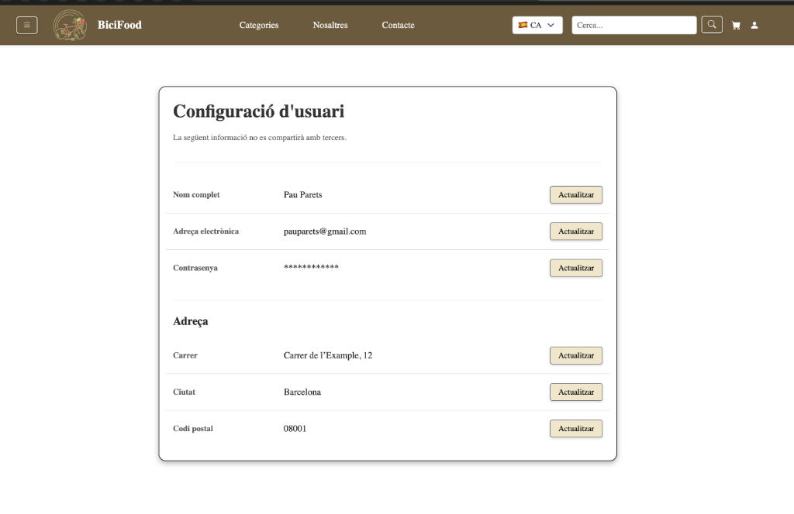

*Figura 3.10: Pàgina de configuració del perfil d'usuari amb dades personals i adreça.*

#### Confirmació i Seguiment de Comanda

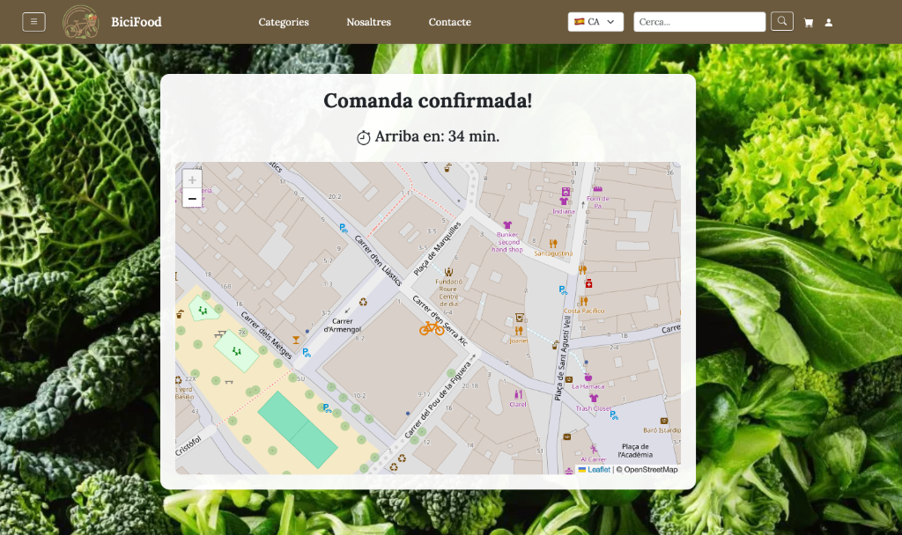

*Figura 3.11: Pantalla de confirmació amb mapa de seguiment en temps real del repartidor.*


---

## 4. Disseny de la Base de Dades

### 4.1. Diagrama Entitat-Relació

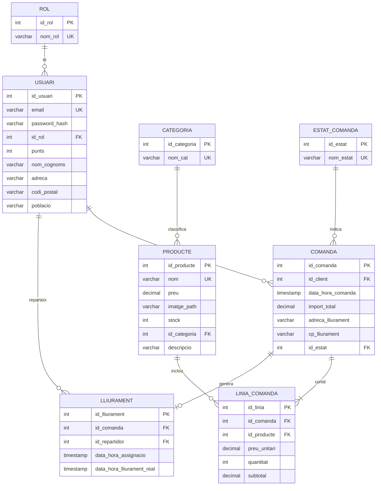
```mermaid
erDiagram
    ROL ||--o{ USUARI : "té"
    USUARI ||--o{ COMANDA : "realitza"
    COMANDA ||--|{ LINIA_COMANDA : "conté"
    PRODUCTE ||--o{ LINIA_COMANDA : "inclou"
    CATEGORIA ||--o{ PRODUCTE : "classifica"
    ESTAT_COMANDA ||--o{ COMANDA : "indica"
    COMANDA ||--o| LLIURAMENT : "genera"
    USUARI ||--o{ LLIURAMENT : "reparteix"

    ROL {
        int id_rol PK
        varchar nom_rol UK
    }

    USUARI {
        int id_usuari PK
        varchar email UK
        varchar password_hash
        int id_rol FK
        int punts
        varchar nom_cognoms
        varchar adreca
        varchar codi_postal
        varchar poblacio
    }

    CATEGORIA {
        int id_categoria PK
        varchar nom_cat UK
    }

    PRODUCTE {
        int id_producte PK
        varchar nom UK
        decimal preu
        varchar imatge_path
        int stock
        int id_categoria FK
        varchar descripcio
    }

    COMANDA {
        int id_comanda PK
        int id_client FK
        timestamp data_hora_comanda
        decimal import_total
        varchar adreca_lliurament
        varchar cp_lliurament
        int id_estat FK
    }

    LINIA_COMANDA {
        int id_linia PK
        int id_comanda FK
        int id_producte FK
        decimal preu_unitari
        int quantitat
        decimal subtotal
    }

    ESTAT_COMANDA {
        int id_estat PK
        varchar nom_estat UK
    }

    LLIURAMENT {
        int id_lliurament PK
        int id_comanda FK
        int id_repartidor FK
        timestamp data_hora_assignacio
        timestamp data_hora_lliurament_real
    }
```

**Diagrama Visual de la Base de Dades:**

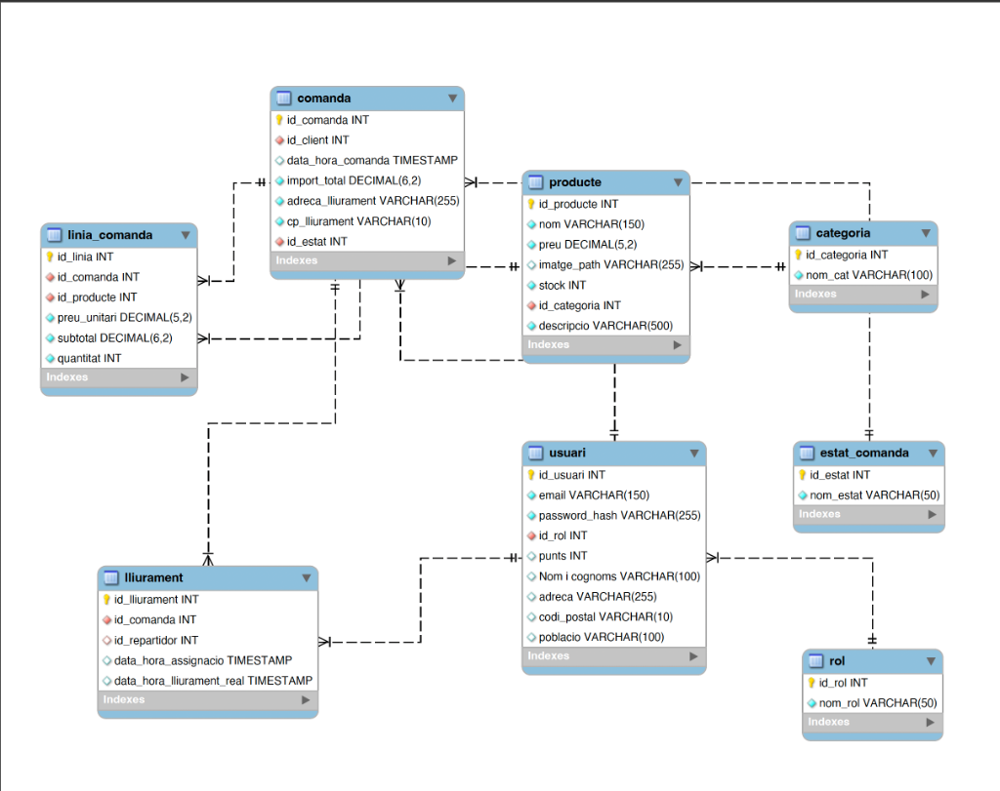

*Figura 4.1: Esquema relacional de la base de dades BiciFood mostrant les 7 taules principals (comanda, producte, categoria, usuari, estat_comanda, linia_comanda, lliurament, rol) i les seves relacions.*


### 4.2. Descripció de Taules

#### ROL
Defineix els diferents tipus d'usuaris del sistema.
- **Rols disponibles**: ADMIN, CLIENT, REPARTIDOR
- **Clau primària**: `id_rol`
- **Restriccions**: `nom_rol` ha de ser únic

#### USUARI
Emmagatzema la informació dels usuaris registrats.
- **Clau primària**: `id_usuari`
- **Clau forana**: `id_rol` → ROL
- **Camps obligatoris**: email, password_hash, id_rol
- **Camps opcionals**: punts, nom i cognoms, adreça, codi postal, població
- **Seguretat**: Les contrasenyes s'emmagatzemen hashejades

#### CATEGORIA
Categories de productes disponibles.
- **Clau primària**: `id_categoria`
- **Categories predefinides**: 
  1. CARNS
  2. PEIXOS
  3. AMANIDES I VEGETALS
  4. ARRÒS I PASTA
  5. BEGUDES
  6. POSTRES

#### PRODUCTE
Catàleg de productes disponibles per a la venda.
- **Clau primària**: `id_producte`
- **Clau forana**: `id_categoria` → CATEGORIA
- **Camps obligatoris**: nom, preu, stock, id_categoria, descripcio
- **Camp opcional**: imatge_path
- **Validacions**: 
  - Preu: decimal(5,2) - màxim 999.99€
  - Stock: enter no negatiu
  - Nom únic

#### COMANDA
Registre de comandes realitzades pels clients.
- **Clau primària**: `id_comanda`
- **Claus foranes**: 
  - `id_client` → USUARI
  - `id_estat` → ESTAT_COMANDA
- **Camps automàtics**: `data_hora_comanda` (CURRENT_TIMESTAMP)
- **Camps obligatoris**: id_client, import_total, adreca_lliurament, cp_lliurament, id_estat

#### LINIA_COMANDA
Detall de productes dins de cada comanda.
- **Clau primària**: `id_linia`
- **Claus foranes**: 
  - `id_comanda` → COMANDA
  - `id_producte` → PRODUCTE
- **Camps obligatoris**: id_comanda, id_producte, preu_unitari, quantitat, subtotal
- **Càlcul**: `subtotal = preu_unitari * quantitat`

#### ESTAT_COMANDA
Estats possibles d'una comanda.
- **Clau primària**: `id_estat`
- **Estats disponibles**:
  1. PENDENT - Comanda rebuda, pendent de processar
  2. PREPARANT - En preparació
  3. EN RUTA - Repartidor en camí
  4. LLIURADA - Comanda entregada

#### LLIURAMENT
Informació sobre el lliurament de comandes.
- **Clau primària**: `id_lliurament`
- **Claus foranes**: 
  - `id_comanda` → COMANDA (UNIQUE)
  - `id_repartidor` → USUARI (nullable)
- **Camps automàtics**: `data_hora_assignacio` (CURRENT_TIMESTAMP)
- **Camps opcionals**: id_repartidor, data_hora_lliurament_real

### 4.3. Configuració de la Base de Dades

#### H2 (Desenvolupament)
```properties
spring.datasource.url=jdbc:h2:mem:bicifood_db
spring.datasource.driverClassName=org.h2.Driver
spring.datasource.username=sa
spring.datasource.password=
spring.h2.console.enabled=true
spring.h2.console.path=/h2-console
```

#### MySQL (Producció)
```properties
spring.datasource.url=jdbc:mysql://localhost:3306/bicifood_db
spring.datasource.username=bicifood_user
spring.datasource.password=[PASSWORD]
spring.jpa.database-platform=org.hibernate.dialect.MySQL8Dialect
```

### 4.4. Població de Dades Inicial

El fitxer `db/bicifood_db_v5.0.sql` conté:
- **21 productes** predefinits amb imatges i descripcions
- **6 categories** de productes
- **3 rols** d'usuari
- **4 estats** de comanda

---

## 5. Documentació del Codi Font

### 5.1. Arquitectura del Backend

L'aplicació segueix el patró **MVC (Model-View-Controller)** adaptat per a APIs REST:

```
backend/src/main/java/com/bicifood/api/
├── config/              # Configuració de l'aplicació
├── controller/          # Controladors REST
├── dto/                 # Data Transfer Objects
├── entity/              # Entitats JPA
├── repository/          # Repositoris d'accés a dades
├── service/             # Lògica de negoci
└── BiciFoodApiApplication.java  # Classe principal
```

#### 5.1.1. Capa de Configuració (`config/`)

**AppConfig.java**
- Configuració de ModelMapper per a mapatge DTO ↔ Entity
- Configuració de CORS per permetre peticions des del frontend
- Beans de configuració general

**SecurityConfig.java**
- Configuració de Spring Security
- Gestió de JWT per a autenticació
- Definició de rutes públiques i protegides
- Configuració de password encoder (BCrypt)

#### 5.1.2. Capa d'Entitats (`entity/`)

Les entitats JPA representen les taules de la base de dades:

| Classe | Taula | Descripció |
|--------|-------|------------|
| `Rol` | `rol` | Rols d'usuari (ADMIN, CLIENT, REPARTIDOR) |
| `Usuari` | `usuari` | Usuaris del sistema |
| `Categoria` | `categoria` | Categories de productes |
| `Producte` | `producte` | Productes del catàleg |
| `EstatComanda` | `estat_comanda` | Estats de comandes |
| `Comanda` | `comanda` | Comandes realitzades |
| `LiniaComanda` | `linia_comanda` | Línies de detall de comandes |
| `Lliurament` | `lliurament` | Informació de lliuraments |

**Exemple: Entitat Producte**
```java
@Entity
@Table(name = "producte")
public class Producte {
    @Id
    @GeneratedValue(strategy = GenerationType.IDENTITY)
    private Integer id;
    
    @NotBlank @Size(max = 150)
    @Column(unique = true)
    private String nom;
    
    @NotNull @DecimalMin("0.01")
    @Digits(integer = 3, fraction = 2)
    private BigDecimal preu;
    
    @ManyToOne(fetch = FetchType.EAGER)
    @JoinColumn(name = "id_categoria")
    private Categoria categoria;
    
    // ... més camps i mètodes
}
```

**Característiques de les Entitats:**
- Anotacions JPA per a mapatge (`@Entity`, `@Table`, `@Column`)
- Validacions Bean Validation (`@NotNull`, `@NotBlank`, `@Size`, etc.)
- Relacions entre entitats (`@ManyToOne`, `@OneToMany`)
- Estratègies de càrrega (`EAGER`, `LAZY`)
- Mètodes `equals()`, `hashCode()`, `toString()` sobreescrits

#### 5.1.3. Capa de Repositoris (`repository/`)

Repositoris Spring Data JPA que hereten de `JpaRepository`:

| Repositori | Entitat | Mètodes Personalitzats |
|------------|---------|------------------------|
| `RolRepository` | Rol | `findByNom(String nom)` |
| `UsuariRepository` | Usuari | `findByEmail(String email)` |
| `CategoriaRepository` | Categoria | `findByNom(String nom)` |
| `ProducteRepository` | Producte | `findByCategoria_Id(Integer id)`, `searchByNomContaining(String nom)` |
| `EstatComandaRepository` | EstatComanda | `findByNom(String nom)` |
| `ComandaRepository` | Comanda | `findByClient_Id(Integer id)` |
| `LiniaComandaRepository` | LiniaComanda | - |
| `LliuramentRepository` | Lliurament | `findByComanda_Id(Integer id)` |

**Exemple: ProducteRepository**
```java
@Repository
public interface ProducteRepository extends JpaRepository<Producte, Integer> {
    Page<Producte> findByCategoria_Id(Integer categoryId, Pageable pageable);
    Page<Producte> findByNomContainingIgnoreCase(String nom, Pageable pageable);
}
```

#### 5.1.4. Capa de Serveis (`service/`)

Conté la lògica de negoci de l'aplicació:

| Servei | Responsabilitat |
|--------|----------------|
| `UsuariService` | Gestió d'usuaris, autenticació |
| `CategoriaService` | Operacions amb categories |
| `ProducteService` | Gestió del catàleg de productes |
| `ComandaService` | Gestió de comandes i lliuraments |

**Exemple: ProducteService**
```java
@Service
public class ProducteService {
    @Autowired
    private ProducteRepository producteRepository;
    
    public Page<ProducteDto> getAllProducts(Pageable pageable) {
        return producteRepository.findAll(pageable)
            .map(this::convertToDto);
    }
    
    public Page<ProducteDto> getProductsByCategory(Integer categoryId, Pageable pageable) {
        return producteRepository.findByCategoria_Id(categoryId, pageable)
            .map(this::convertToDto);
    }
    
    // ... més mètodes
}
```

#### 5.1.5. Capa de DTOs (`dto/`)

Data Transfer Objects per a la comunicació amb el frontend:

| DTO | Ús |
|-----|-----|
| `ProducteDto` | Transferència de dades de productes |
| `CategoriaDto` | Transferència de dades de categories |
| `LoginRequestDto` | Petició d'autenticació |
| `LoginResponseDto` | Resposta amb token JWT |

**Avantatges dels DTOs:**
- Desacoblament entre capes
- Control sobre les dades exposades (no exposa camps sensibles)
- Evita problemes de serialització JSON amb relacions JPA
- Permet validacions específiques per a entrada/sortida

#### 5.1.6. Capa de Controladors (`controller/`)

Controladors REST que exposen els endpoints de l'API:

| Controlador | Base Path | Responsabilitat |
|-------------|-----------|----------------|
| `ProducteController` | `/api/v1/products` | CRUD de productes |
| `CategoriaController` | `/api/v1/categories` | Llistat de categories |

**Exemple: ProducteController**
```java
@RestController
@RequestMapping("/api/v1/products")
@CrossOrigin(origins = "http://localhost:3000")
public class ProducteController {
    
    @GetMapping
    public ResponseEntity<Page<ProducteDto>> getAllProducts(
        @RequestParam(defaultValue = "0") int page,
        @RequestParam(defaultValue = "20") int size
    ) {
        // ...
    }
    
    @GetMapping("/{id}")
    public ResponseEntity<ProducteDto> getProductById(@PathVariable Integer id) {
        // ...
    }
    
    @GetMapping("/category/{categoryId}")
    public ResponseEntity<Page<ProducteDto>> getProductsByCategory(
        @PathVariable Integer categoryId,
        @RequestParam(defaultValue = "0") int page,
        @RequestParam(defaultValue = "20") int size
    ) {
        // ...
    }
    
    @GetMapping("/search")
    public ResponseEntity<Page<ProducteDto>> searchProducts(
        @RequestParam String name,
        @RequestParam(defaultValue = "0") int page,
        @RequestParam(defaultValue = "20") int size
    ) {
        // ...
    }
}
```

**Endpoints Disponibles:**

| Mètode | Endpoint | Descripció |
|--------|----------|------------|
| GET | `/api/v1/products` | Llistar tots els productes (paginat) |
| GET | `/api/v1/products/{id}` | Obtenir un producte per ID |
| GET | `/api/v1/products/category/{id}` | Productes per categoria (paginat) |
| GET | `/api/v1/products/search?name={nom}` | Cercar productes per nom |
| GET | `/api/v1/categories` | Llistar totes les categories |

### 5.2. Arquitectura del Frontend

```
frontend/
├── html/TEA5/           # Pàgines HTML
│   ├── components/      # Components reutilitzables
│   ├── *.html          # Pàgines de l'aplicació
│   └── style.css       # Estils personalitzats
├── js/                  # Lògica JavaScript
│   ├── api.js          # Client API
│   ├── i18n.js         # Sistema d'internacionalització
│   ├── userConfig.js   # Configuració d'usuari
│   └── translations/   # Fitxers de traducció
└── images/             # Imatges i recursos
```

#### 5.2.1. Client API (`js/api.js`)

**Classe BiciFoodAPI:**
```javascript
class BiciFoodAPI {
    constructor() {
        this.baseURL = 'http://localhost:8080/api/v1';
        this.headers = {
            'Content-Type': 'application/json',
            'Accept': 'application/json'
        };
    }
    
    async getProducts(page = 0, size = 20) {
        return await this.makeRequest(`/products?page=${page}&size=${size}`);
    }
    
    async getProductsByCategory(categoryId, page = 0, size = 20) {
        return await this.makeRequest(
            `/products/category/${categoryId}?page=${page}&size=${size}`
        );
    }
    
    async searchProducts(query, page = 0, size = 20) {
        return await this.makeRequest(
            `/products/search?name=${encodeURIComponent(query)}&page=${page}&size=${size}`
        );
    }
}
```

**Objecte Utils:**
- `loadCategoriesDropdown()`: Carrega categories al menú desplegable
- `loadProducts()`: Carrega productes en un contenidor
- `createProductCard()`: Crea targeta HTML per a un producte
- `getProductImagePath()`: Gestiona rutes d'imatges amb fallback
- `showAlert()`: Mostra alertes personalitzades

**Objecte Cart:**
- `getItems()`: Obté articles de localStorage
- `saveItems()`: Guarda articles a localStorage
- `addItem()`: Afegeix producte a la cistella
- `removeItem()`: Elimina producte de la cistella
- `updateCartCounter()`: Actualitza el comptador visual
- `clear()`: Buida la cistella

#### 5.2.2. Sistema d'Internacionalització (`js/i18n.js`)

```javascript
class I18n {
    constructor() {
        this.currentLanguage = localStorage.getItem('preferredLanguage') || 'ca';
        this.translations = {};
    }
    
    async loadTranslations(lang) {
        const response = await fetch(`../../js/translations/${lang}.json`);
        this.translations[lang] = await response.json();
    }
    
    translate(key) {
        // Navega per l'objecte de traduccions utilitzant la clau
        const keys = key.split('.');
        let value = this.translations[this.currentLanguage];
        for (const k of keys) {
            value = value?.[k];
        }
        return value || key;
    }
    
    async changeLanguage(lang) {
        this.currentLanguage = lang;
        localStorage.setItem('preferredLanguage', lang);
        await this.loadTranslations(lang);
        this.updatePageContent();
    }
}
```

**Idiomes Suportats:**
- Català (ca) - Per defecte
- Castellà (es)
- Anglès (en)

### 5.3. Flux de Comunicació Backend-Frontend

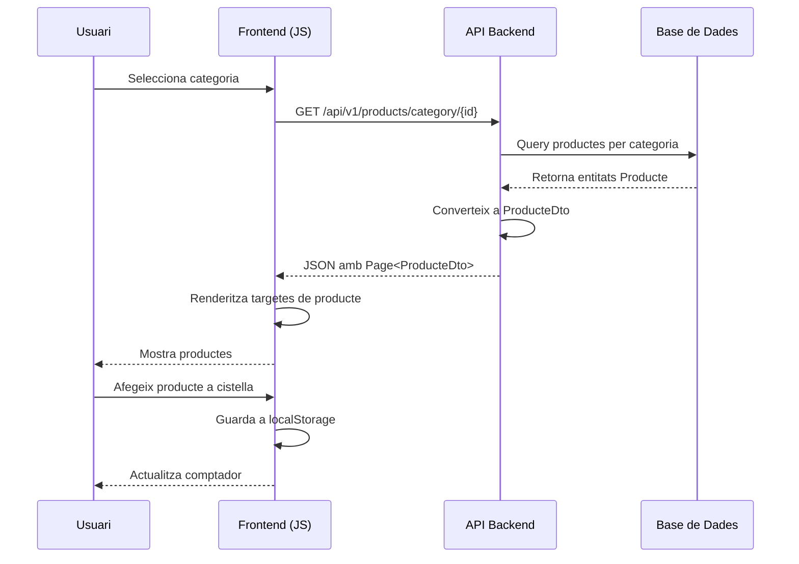
```mermaid
sequenceDiagram
    participant U as Usuari
    participant F as Frontend (JS)
    participant A as API Backend
    participant D as Base de Dades

    U->>F: Selecciona categoria
    F->>A: GET /api/v1/products/category/{id}
    A->>D: Query productes per categoria
    D-->>A: Retorna entitats Producte
    A->>A: Converteix a ProducteDto
    A-->>F: JSON amb Page<ProducteDto>
    F->>F: Renderitza targetes de producte
    F-->>U: Mostra productes
    
    U->>F: Afegeix producte a cistella
    F->>F: Guarda a localStorage
    F-->>U: Actualitza comptador
```

### 5.4. Patrons de Disseny Utilitzats

#### Backend
1. **Repository Pattern**: Abstracció de l'accés a dades
2. **Service Layer Pattern**: Encapsulació de la lògica de negoci
3. **DTO Pattern**: Transferència de dades entre capes
4. **Dependency Injection**: Gestió de dependències amb Spring
5. **Builder Pattern**: Construcció d'objectes complexos (ModelMapper)

#### Frontend
1. **Module Pattern**: Encapsulació de funcionalitat (API, Cart, Utils)
2. **Singleton Pattern**: Instància global de l'API
3. **Observer Pattern**: Event listeners per a interaccions

---

## 6. Instal·lació i Configuració

### 6.1. Requisits Previs

#### Software Necessari
- **Java Development Kit (JDK) 21** o superior
  - Descarregar de: https://adoptium.net/ o https://www.oracle.com/java/technologies/downloads/
  - Verificar: `java -version`
  
- **Maven 3.8+** (opcional, el projecte inclou Maven Wrapper)
  - Descarregar de: https://maven.apache.org/download.cgi
  - Verificar: `mvn -version`
  
- **Python 3.x** (per al servidor HTTP del frontend)
  - Descarregar de: https://www.python.org/downloads/
  - Verificar: `python3 --version`

#### Opcional
- **Docker** (per a execució containeritzada)
  - Descarregar de: https://www.docker.com/products/docker-desktop
  - Verificar: `docker --version`

- **Git** (per a clonar el repositori)
  - Descarregar de: https://git-scm.com/downloads
  - Verificar: `git --version`

### 6.2. Instal·lació

#### Opció 1: Clonar el Repositori
```bash
git clone https://github.com/[usuari]/biciFood.git
cd biciFood
```

#### Opció 2: Descarregar ZIP
1. Descarregar el ZIP del projecte
2. Descomprimir en la ubicació desitjada
3. Navegar al directori del projecte

### 6.3. Configuració del Backend

#### 6.3.1. Configuració de la Base de Dades

**H2 (Per defecte - No requereix configuració)**

L'aplicació ve configurada per utilitzar H2 en memòria. No cal fer res addicional.

**MySQL (Opcional - Per a producció)**

1. Crear la base de dades:
```bash
mysql -u root -p < db/bicifood_db_v5.0.sql
```

2. Copiar el fitxer d'exemple de configuració:
```bash
cd backend
cp application.properties.example src/main/resources/application.properties
```

3. Editar `application.properties` amb les credencials de MySQL:
```properties
spring.datasource.url=jdbc:mysql://localhost:3306/bicifood_db
spring.datasource.username=bicifood_user
spring.datasource.password=[LA_TEVA_CONTRASENYA]
```

4. Descomentar la dependència MySQL al `pom.xml`:
```xml
<dependency>
    <groupId>mysql</groupId>
    <artifactId>mysql-connector-java</artifactId>
    <version>8.0.33</version>
</dependency>
```

#### 6.3.2. Configuració JWT (Opcional)

Per personalitzar la clau secreta JWT, editar `application.properties`:
```properties
jwt.secret=[LA_TEVA_CLAU_SECRETA]
jwt.expiration=86400000
```

#### 6.3.3. Compilar el Backend
```bash
cd backend
./mvnw clean package -DskipTests
```

Això generarà un fitxer JAR a `backend/target/bicifood-api-1.0.0.jar`

### 6.4. Execució de l'Aplicació

#### Opció 1: Executar amb Scripts (Recomanat)

**macOS / Linux:**
```bash
chmod +x start-bicifood.sh stop-bicifood.sh
./start-bicifood.sh
```

**Windows:**
1. Navegar a la carpeta del projecte
2. Fer doble clic a `start-bicifood.bat`
3. O executar des de CMD: `.\start-bicifood.bat`

Els scripts inicien automàticament:
- Backend a http://localhost:8080
- Frontend a http://localhost:3000

**Aturar l'aplicació:**
```bash
# macOS / Linux
./stop-bicifood.sh

# Windows
.\stop-bicifood.bat
```

#### Opció 2: Executar Manualment

**Backend:**
```bash
cd backend
./mvnw spring-boot:run
```

**Frontend (en una nova terminal):**
```bash
cd frontend/html/TEA5
python3 -m http.server 3000
```

#### Opció 3: Executar amb Docker

**Construir la imatge:**
```bash
docker build -t bicifood .
```

**Executar el contenidor:**
```bash
docker run -d -p 8080:8080 -p 3000:3000 --name bicifood bicifood
```

**Aturar i eliminar el contenidor:**
```bash
docker stop bicifood && docker rm bicifood
```

### 6.5. Accés a l'Aplicació

Una vegada iniciada, es pot accedir a:

| Servei | URL | Descripció |
|--------|-----|------------|
| **Frontend Principal** | http://localhost:3000/frontend/html/TEA5/index.html | Pàgina d'inici de l'aplicació |
| **Backend API** | http://localhost:8080/api/v1 | Base URL de l'API REST |
| **Swagger UI** | http://localhost:8080/api/v1/swagger-ui/index.html | Documentació interactiva de l'API |
| **H2 Console** | http://localhost:8080/api/v1/h2-console | Consola de la base de dades H2 |
| **Actuator Health** | http://localhost:8080/api/v1/actuator/health | Estat de salut de l'aplicació |

### 6.6. Verificació de la Instal·lació

#### 1. Verificar Backend
```bash
curl http://localhost:8080/api/v1/actuator/health
```
Resposta esperada: `{"status":"UP"}`

#### 2. Verificar API de Productes
```bash
curl http://localhost:8080/api/v1/products
```
Hauria de retornar un JSON amb el llistat de productes.

#### 3. Verificar Frontend
Obrir http://localhost:3000/frontend/html/TEA5/index.html al navegador i comprovar que es carreguen els productes.

### 6.7. Resolució de Problemes

#### El backend no inicia
- **Error**: `Port 8080 already in use`
  - **Solució**: Modificar el port a `application.properties`:
    ```properties
    server.port=8081
    ```

- **Error**: `Java version mismatch`
  - **Solució**: Assegurar que s'utilitza Java 21:
    ```bash
    java -version
    export JAVA_HOME=/path/to/java21
    ```

#### El frontend no es carrega
- **Error**: `Failed to fetch from API`
  - **Solució**: Verificar que el backend està en execució i accessible a http://localhost:8080

- **Error**: CORS policy
  - **Solució**: Verificar la configuració CORS a `SecurityConfig.java`

#### Les imatges no es mostren
- **Solució**: Verificar que la carpeta `frontend/images/` conté les imatges dels productes. Les imatges haurien de coincidir amb els noms especificats a la base de dades.

### 6.8. Configuració per a Producció

#### 6.8.1. Backend
1. Canviar a base de dades MySQL persistent
2. Configurar variables d'entorn per a les credencials:
   ```bash
   export DB_URL=jdbc:mysql://production-db:3306/bicifood_db
   export DB_USERNAME=prod_user
   export DB_PASSWORD=secure_password
   export JWT_SECRET=production_secret_key
   ```

3. Compilar amb perfil de producció:
   ```bash
   ./mvnw clean package -Pprod -DskipTests
   ```

4. Executar amb opcions de producció:
   ```bash
   java -Xmx512m -Xms256m -jar target/bicifood-api-1.0.0.jar \
     --spring.profiles.active=prod
   ```

#### 6.8.2. Frontend
1. Modificar la URL de l'API a `js/api.js`:
   ```javascript
   this.baseURL = 'https://api.bicifood.com/api/v1';
   ```

2. Servir amb un servidor web de producció (Nginx, Apache):
   ```nginx
   server {
       listen 80;
       server_name www.bicifood.com;
       root /var/www/bicifood/frontend/html/TEA5;
       index index.html;
   }
   ```

#### 6.8.3. Docker en Producció
```bash
# Utilitzar volums per a persistència
docker run -d \
  -p 8080:8080 \
  -p 3000:3000 \
  -v bicifood_data:/app/data \
  --name bicifood-prod \
  --restart unless-stopped \
  bicifood
```

### 6.9. Manteniment

#### Actualització de Dependències
```bash
cd backend
./mvnw versions:display-dependency-updates
./mvnw versions:use-latest-releases
```

#### Còpia de Seguretat de la Base de Dades

**H2:**
```bash
# Les dades es perden en reiniciar (en memòria)
# Per persistència, canviar a fitxer a application.properties:
spring.datasource.url=jdbc:h2:file:./data/bicifood
```

**MySQL:**
```bash
mysqldump -u root -p bicifood_db > backup_$(date +%Y%m%d).sql
```

#### Logs de l'Aplicació

Els logs es mostren a la consola. Per guardar-los en fitxers, configurar `application.properties`:
```properties
logging.file.name=logs/bicifood.log
logging.level.com.bicifood=DEBUG
```

---

## 📚 Referències i Recursos Addicionals

### Documentació Oficial

- **Spring Boot**: https://spring.io/projects/spring-boot
- **Spring Data JPA**: https://spring.io/projects/spring-data-jpa
- **Spring Security**: https://spring.io/projects/spring-security
- **H2 Database**: https://www.h2database.com/
- **Bootstrap 5**: https://getbootstrap.com/docs/5.3/
- **Swagger/OpenAPI**: https://swagger.io/docs/

### Eines Recomanades

- **IntelliJ IDEA**: IDE per a desenvolupament Java
- **Visual Studio Code**: Editor per al frontend
- **Postman**: Testing d'APIs REST
- **MySQL Workbench**: Gestió de bases de dades MySQL

### Contacte i Suport

Per a preguntes o incidències relacionades amb el projecte:
- **Email**: support@bicifood.com
- **Repository**: https://github.com/bicifood/biciFood

---
